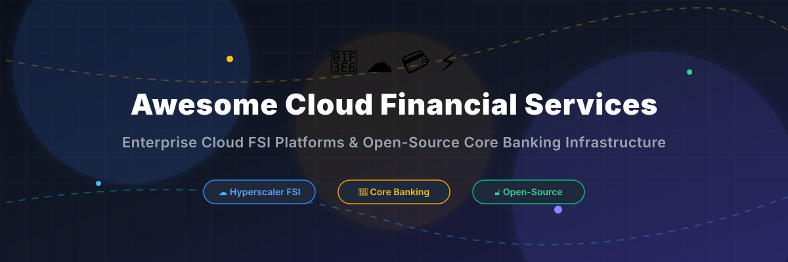

# Awesome-Cloud-Financial-Services-Solutions 🏦 ☁️

  

  
  
  
  
  

---

## 🌟 Top Cloud Financial Services Solutions Ecosystem 🏦 ☁️

**Curated List of Commercial Financial Services Platforms & Open-Source Banking Infrastructure** 🚀  
*Focused on Core Banking Modernization, Payments Processing, Lending Automation, Regulatory Compliance, Wealth Management & Self-Hosted Financial Platforms*

**Last updated: October 2026** 📅

---

### 📌 Overview & SEO Summary 🔍
Welcome to the ultimate community-curated directory of **cloud financial services solutions**, **open-source core banking platforms**, **fintech infrastructure frameworks**, and **self-hosted wealth management tools**. 

Whether you are evaluating enterprise-grade commercial platforms for tier-1 financial institutions (such as *Microsoft Cloud for Financial Services*, *AWS Financial Services*, *Google Cloud Financial Services*, *Fiserv*, *FIS*, *Temenos*, *nCino*, *Thought Machine*, *Finastra*, and *Mambu*), or exploring self-hostable open-source alternatives (like *OpenBB Terminal*, *Maybe Finance*, *ERPNext*, *Actual Budget*, *Firefly III*, *Invoice Ninja*, *Akaunting*, *Kill Bill*, *Ghostfolio*, *Apache Fineract*, *Formance*, *GnuCash*, *Ballerine*, *Mifos X*, *WSO2 Micro Integrator*, *Mojaloop*, and *Cyclos*), this comprehensive guide covers market size estimates, specific pricing structures, free tier terms, GitHub star metrics, and structural market dynamics across modern fintech.

---

## 📑 Table of Contents 📖
- [🏢 SaaS & Commercial Platforms](#-saas--commercial-platforms)
- [🔓 Open-Source GitHub Projects](#-open-source-github-projects)
- [🛠️ How to Contribute](#%EF%B8%8F-how-to-contribute)
- [📊 Star History](#-star-history)
- [🤝 Support & Sponsorship](#-support--sponsorship)
- [⚠️ Disclaimer](#%EF%B8%8F-disclaimer)

---

## 🏢 SaaS / Commercial Platforms 💼

**Market Size & Sector Structure**: The global cloud financial services & core banking software market is estimated at **$48.5 Billion in 2026** (projected to reach **$92 Billion by 2030 at a 13.8% CAGR**). The sector is **moderately fragmented**: hyperscaler cloud platforms (Microsoft, AWS, GCP) and legacy core banking titans (Fiserv, FIS) dominate market share in infrastructure and legacy core processing, while specialized cloud-native SaaS platforms (nCino, Thought Machine, Mambu, Temenos) capture rapid market share growth in modern API-first banking and agentic AI workflows. 📈

*Sorted by Valuation / Market Cap (Descending)* 📊

| SaaS / Commercial Platform | Company / Owner | Valuation / Market Cap | Standard Edition Starting Price | Free Tier / Free Trial Limits | Description |
| :--- | :--- | :--- | :--- | :--- | :--- |
| **[Microsoft Cloud for Financial Services](https://www.microsoft.com/en-us/industry/financial-services)** 🔷 | Microsoft | ~$3.90 Trillion | **$20/user/month add-on** (plus underlying Azure usage charges) | **30-day free trial** + **$200 Azure free credits** for new accounts | **Hyperscaler industry cloud** — **100+ compliance offerings**. **Azure landing zones** for FSI workloads. **Microsoft Purview** for data governance and regulatory compliance. **Confidential computing and Managed HSM** for sensitive workloads . |
| **[AWS Financial Services](https://aws.amazon.com/financial-services/)** ☁️ | Amazon | ~$2.0 Trillion | **Pay-as-you-go** (e.g. EC2 `t4g.medium` at ~$0.0336/hour) | **12-month Free Tier** (750 hrs/mo EC2, 5 GB S3) | **Hyperscaler FSI cloud** — **250+ compliance certifications** including PCI DSS, SOC 1/2/3, and FedRAMP. **AWS Well-Architected Framework for FSI**. **Amazon FinSpace** for financial data analytics. **AWS Payment Cryptography** for payment processing . |
| **[Google Cloud Financial Services](https://cloud.google.com/solutions/financial-services)** 🌐 | Google (Alphabet) | ~$2.0 Trillion | **Pay-as-you-go** (e.g. Compute Engine `e2-standard-2` at ~$0.067/hour) | **$300 free credits** (90-day validity) + 20+ always-free products | **Hyperscaler FSI platform** — **Well-Architected Framework for FSI** with **multi-zone and multi-region** resilience. Addresses **Federal Reserve, EBA, and PRA** requirements. **Design principles for banks, payment infrastructure, insurance, and capital markets** . |
| **[Fiserv](https://www.fiserv.com/)** 🟢 | Fiserv | ~$90 Billion | **$2,500/month base platform fee** (plus volume processing fees) | **30-day sandbox developer trial** with simulated API environments | **Account processing platform** — **DNA** core banking for banks and credit unions. **Open architecture** for integration with fintech partners. **Clover** for merchant payments . |
| **[FIS](https://www.fisglobal.com/)** 🔵 | FIS | ~$40 Billion | **$3,000/month base enterprise package** (plus transaction fees) | **14-day interactive guided developer sandbox** | **Banking and payments technology** — Core processing, digital banking, and payment solutions. **Serves financial institutions of all sizes globally**. **Modern Banking Platform** for cloud-native core processing . |
| **[Temenos](https://www.temenos.com/)** 🏦 | Temenos AG | ~$5 Billion | **$50,000/year base SaaS license** (Temenos SaaS Core) | **30-day access to Temenos Developer Sandbox** | **Enterprise core banking** — **Temenos Transact** for corporate and retail banks. Supports **Islamic banking, cooperatives, and non-bank financial institutions**. Wide feature set for large multi-location institutions with **maximal automation and centralization** . |
| **[nCino Agentic Banking](https://www.ncino.com/)** 🤖 | nCino, Inc. | ~$3 Billion | **$1,200/user/year** (nCino Bank Operating System) | **14-day customized enterprise proof-of-concept / demo trial** | **Agentic AI banking platform** — **2,700+ customers worldwide**. **Agentic Operating System (AOS)** enables custom AI agents with **auditable, explainable actions**. **Banking Advisor** reduced document search from **20 minutes to 30 seconds (97.5% reduction)** at ConnectOne Bank . |
| **[Thought Machine Vault Core](https://www.thoughtmachine.net/)** 🧠 | Thought Machine | Private (~$2.7 Billion valuation) | **$100,000/year starting SaaS tier** (cloud-agnostic core processing) | **30-day access to Thought Machine Developer Sandbox** | **Cloud-native core banking** — **Built from scratch without legacy code**. **Smart contracts** configure any financial product. **200+ preconfigured products** in Product Library. **API-first architecture**. Trusted by **JPMorgan Chase, Lloyds, Standard Chartered, ING, SEB, and Intesa Sanpaolo** . |
| **[Finastra FusionFabric](https://www.finastra.com/)** 🟠 | Finastra | Private (~$2.0 Billion valuation) | **$2,000/month API connector subscription** (FusionFabric.cloud) | **30-day free developer tier** on FusionFabric.cloud API portal | **Open banking platform** — **FusionFabric.cloud** for building and deploying financial applications. **Core banking, lending, and treasury** solutions. **Open API ecosystem** for fintech collaboration . |
| **[Mambu](https://www.mambu.com/)** 🏗️ | Mambu | Private (~$1.7 Billion valuation) | **$4,000/month starting tenant fee** (composable core engine) | **14-day full-access sandbox environment** for qualified institutions | **SaaS core banking** — **Cloud-native, API-first** core banking platform for banks and fintechs. **Composable architecture** for rapid product launch. **The leading pure-SaaS core banking provider** . |

---

## 🔓 Open-Source GitHub Projects 🌐

*Sorted by GitHub Stars Count (Descending)* 🌟

- **[OpenBB Terminal](https://github.com/OpenBB-finance/OpenBB)**  ⭐ **73,918 stars**  
  **Open-source investment research platform**, AGPL-3.0 licensed. **Bloomberg Terminal alternative** for retail investors and financial analysts. Provides quantitative analysis tools for **stocks, options, crypto, forex, macro data, and financial statements**. **The standard open-source financial data platform**. 📊

- **[Maybe Finance](https://github.com/maybe-finance/maybe)**  ⭐ **54,240 stars**  
  **AI-powered personal finance & wealth management tool**, AGPL-3.0 licensed. **Budgeting, investing, net worth tracking, and achieving financial goals** with personalized insights. **Open Source Alternative to Mint and Personal Capital**. **The most starred open-source personal finance application on GitHub**. 💰

- **[ERPNext](https://github.com/frappe/erpnext)**  ⭐ **39,856 stars**  
  **Open-source ERP with enterprise accounting and financial modules**, GPL-3.0 licensed. Features **general ledger, multi-currency accounting, invoicing, budgeting, HR, CRM, and asset management**. **Customizable and scalable for businesses of all sizes**. **The foundation for financial operations in mid-size enterprises**. 📈

- **[Actual Budget](https://github.com/actualbudget/actual)**  ⭐ **29,339 stars**  
  **Super-fast, privacy-focused open-source personal finance system**, MIT licensed. Features **zero-based budgeting, multi-device synchronization, bank syncing capabilities, and local-first data privacy**. **The modern open-source alternative to YNAB (You Need A Budget)**. 💵

- **[Firefly III](https://github.com/firefly-iii/firefly-iii)**  ⭐ **24,839 stars**  
  **Self-hosted personal finances manager**, AGPL-3.0 licensed. **Track expenses, income, budgets, subscriptions, and financial categories** using strict double-entry bookkeeping principles. Includes extensive REST API and automation rules. **The power-user standard for self-hosted finance**. 🔥

- **[Invoice Ninja](https://github.com/invoiceninja/invoiceninja)**  ⭐ **10,234 stars**  
  **Powerful open-source invoicing, expense tracking, and payment processing platform**, Elastic License 2.0. Offers **custom invoice templates, client portals, recurring billing, and payment gateway integration** (Stripe, PayPal, Authorize.net). **Free invoicing software for small businesses and freelancers**. 🧾

- **[Akaunting](https://github.com/akaunting/akaunting)**  ⭐ **10,165 stars**  
  **Modular open-source accounting software for small businesses**, GPL-3.0 licensed. **Invoicing, expense tracking, financial reporting, vendor management, and app marketplace extensions**. **Open-source alternative to QuickBooks and Xero**. 📒

- **[Ghostfolio](https://github.com/ghostfolio/ghostfolio)**  ⭐ **9,411 stars**  
  **Open-source wealth management & portfolio tracking software**, AGPL-3.0 licensed. **Track stocks, ETFs, cryptocurrencies, cash, and dividends across multiple accounts** with privacy-first analytics and asset allocation insights. 📈

- **[Kill Bill](https://github.com/killbill/killbill)**  ⭐ **5,785 stars**  
  **Open-source subscription billing & payment platform**, Apache-2.0 licensed. Designed to handle **complex recurring billing, payment gateway routing, invoice generation, and financial ledger integration** for enterprise SaaS and digital platforms. 💳

- **[GnuCash](https://github.com/Gnucash/gnucash)**  ⭐ **4,367 stars**  
  **Double-entry accounting and financial management software**, GPL-2.0 licensed. Designed for **small business accounting, personal finance tracking, stock portfolio management, and scheduled transactions**. Available on Windows, macOS, and Linux. 💼

- **[Apache Fineract](https://github.com/apache/fineract)**  ⭐ **2,533 stars**  
  **Open-source core banking platform**, Apache-2.0 licensed. **Designed to create a cloud-ready core banking system** that enables digital financial services for **everyone, including the unbanked and underbanked**. **Cloud-native, multi-tenant Spring enterprise Java architecture**. Deployed in **500+ financial institutions serving 20M+ individuals across 56 countries** (MFIs, SACCOs, digital banks, and public sector national financial infrastructure in Mexico, India, and Sierra Leone). **The global standard for open-source core banking engines**. 🏦

- **[Ballerine](https://github.com/ballerine-io/ballerine)**  ⭐ **2,437 stars**  
  **Open-source risk management & compliance platform**, Apache-2.0 licensed. **Enables rapid merchant onboarding, underwriting, continuous risk monitoring, and automated KYC/KYB workflows**. **Open-source alternative to SumSub and Alloy** for financial institutions. 🛡️

- **[Formance Ledger](https://github.com/formancehq/ledger)**  ⭐ **1,417 stars**  
  **Programmable financial ledger & payments orchestration engine**, Apache-2.0 licensed. **Track complex money flows, design multi-party transaction paths, and build immutable financial ledgers** for cloud fintech products. ⚡

- **[Mifos X](https://github.com/openMF/mifosx)**  ⭐ **528 stars**  
  **Reference web and mobile financial application suite for Apache Fineract**, MPL-2.0 licensed. Provides **staff web portals, customer mobile banking apps, reporting engines, and payment orchestration connectors** built by The Mifos Initiative (501(c)3 non-profit). 📱

- **[WSO2 Micro Integrator Tooling](https://github.com/wso2/product-mi-tooling)**  ⭐ **327 stars**  
  **Open-source integration tooling layer for banking modernization**, Apache-2.0 licensed. Deployed at institutions like **Nib International Bank** to **decouple core banking systems (e.g. Temenos T24) from third-party fintech applications** with zero software licensing costs. 🔗

- **[Cyclos](https://github.com/cyclosproject/cyclos4)**  ⭐ **222 stars**  
  **Scalable open-source banking software**, AGPL-3.0 licensed. Features **online banking, mobile payments, e-commerce integration, credit system management, and community currency processing**. 🔄

- **[Mojaloop Project](https://github.com/mojaloop/project)**  ⭐ **37 stars**  
  **Open-source blueprint & software for instant payment interoperability**, Apache-2.0 licensed. Supported by the Bill & Melinda Gates Foundation to **connect digital financial service providers, banks, and mobile network operators** across emerging markets. 🌐

---

## 🛠️ How to Contribute 🤝

Contributions are welcome! Follow these steps to submit new cloud financial services platforms or open-source banking software:

1. 🍴 **Fork** the repository.
2. 📝 **Add/edit** entries in `README.md` maintaining table/list structure and formatting.
3. 🔗 Include project title, official website/GitHub link, exact Stars_Count, license, and brief description.
4. 🚀 Submit a **Pull Request** with a descriptive summary of your changes.

---

## 🤝 Support & Sponsorship ☕

Thank you for exploring and using this curated directory of cloud financial services solutions and open-source core banking platforms! Your support helps keep this ecosystem active, up-to-date, and accessible to developers worldwide.

If you find this project valuable:
- ⭐ **Star this repository** to show your appreciation and help others discover it!
- 🔀 **Fork and Share** it on social media, developer forums, and with your team.
- ☕ **Buy Me a Coffee / Sponsor**: Support ongoing maintenance and research via the [GitHub Sponsor Dashboard](https://github.com/sponsors/ishandutta2007).

---

## 📈 Star History

---

## ⚠️ Disclaimer 📜

- This is a **community-curated** list — not exhaustive and not an official endorsement. ℹ️
- **Core banking systems are not interchangeable with general financial software** — they handle deposits, loans, payments, and regulatory reporting. **Apache Fineract is production-proven** in 500+ institutions across 56 countries , but requires **significant operational expertise** for production deployments.
- **nCino's Agentic AI banking** delivers measurable results — **97.5% reduction in document search time** and **41% growth in active users in 10 weeks** at ConnectOne Bank . However, **agentic AI in banking requires governance** — every AI-assisted action must be **auditable, explainable, and under the institution's control**.
- **Thought Machine Vault Core is cloud-agnostic** — banks choose their hosting provider, or use it as SaaS . **Tier 1 banks including JPMorgan Chase, Lloyds, and Standard Chartered** are among its customers and investors .
- **WSO2 demonstrated open-source banking integration at scale**: Nib International Bank decoupled Temenos T24 from third parties with **zero licensing cost**, but **internal team investment** was critical to success .
- **Open-source core banking is not free** — Fineract and Mifos eliminate licensing costs, but **implementation, customization, compliance validation, and ongoing operations** require dedicated engineering resources. **Always validate regulatory compliance** with your specific jurisdiction's requirements before deploying any financial services platform. **Financial infrastructure demands the highest levels of security, availability, and auditability**. 🏦

---

  <b>Made with ❤️ for fintech engineers, banking architects, and open-source financial infrastructure advocates.</b>

